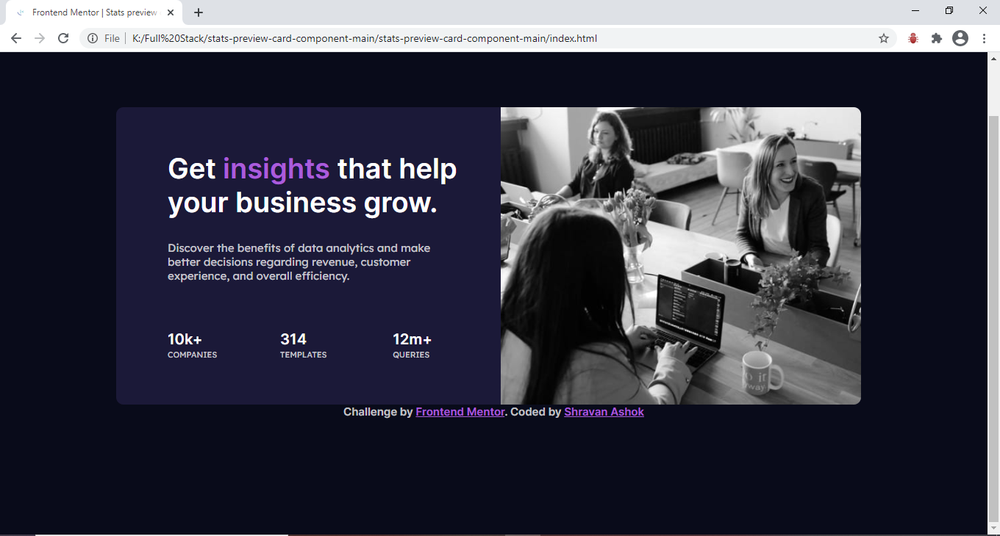

# Frontend Mentor - Stats preview card component solution

This is a solution to the [Stats preview card component challenge on Frontend Mentor](https://www.frontendmentor.io/challenges/stats-preview-card-component-8JqbgoU62). Frontend Mentor challenges help you improve your coding skills by building realistic projects.

## Table of contents

- [Overview](#overview)
  - Stats preview card component (#the-challenge)
  - .\images\Screenshot.PNG(#screenshot)
  - [Links](#links)
- [My process](#my-process)
  - [Built with](#built-with)
  - [What I learned](#what-i-learned)
  - [Continued development](#continued-development)
  - [Useful resources](#useful-resources)
- [Author](#author)
- [Acknowledgments](#acknowledgments)

**Note: Delete this note and update the table of contents based on what sections you keep.**

## Overview

### The challenge

Users should be able to:

- View the optimal layout depending on their device's screen size

### Screenshot

### Links

- Solution URL: www.shrvnash.github.io/PreviewCard/
- Live Site URL: www.shrvnash.github.io/PreviewCard/

## My process

### Built with

- Atom
- CSS custom properties
- CSS Grid

### What I learned

The main topic I learnt as I was designing the project is the positioning of the elements and the styling of elements using CSS. Also learnt about the placement of the tags and images in the code to get the required design. 

### Continued development

I will be continuing my learning about the positioning and styling of elements as i am for less expierenced with them and need to improve my overall knowledge about designing the website and how to configure the site to fit the dimensions in mobile and desktop which is not an easy solution and i need to increase my knowledge to achieve it.

## Author

- Website - www.shrvnash.github.io(https://www.your-site.com)
- Frontend Mentor - @shrvnash(https://www.frontendmentor.io/profile/shrvnash)
